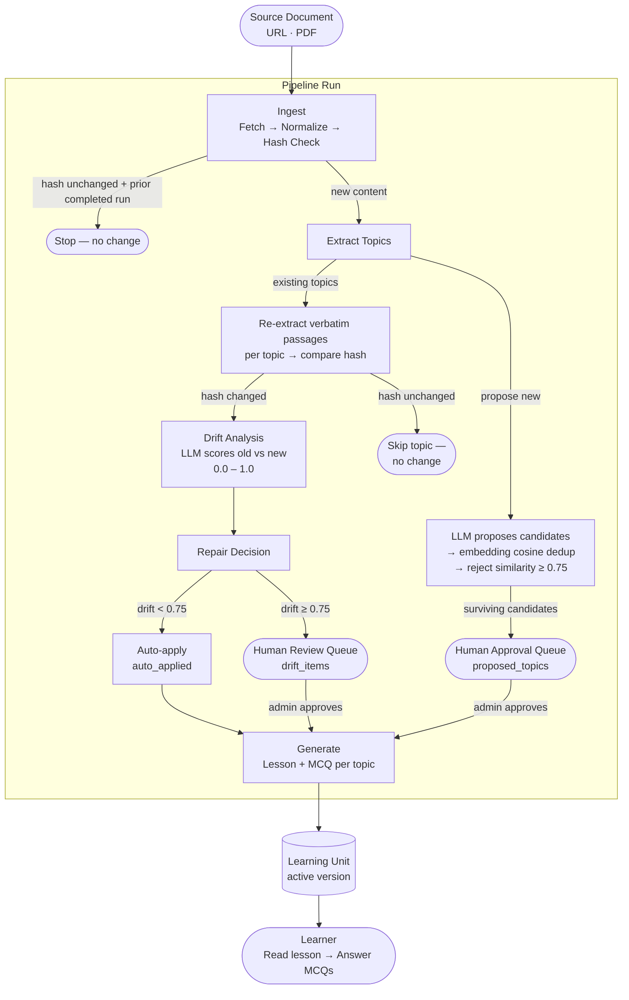
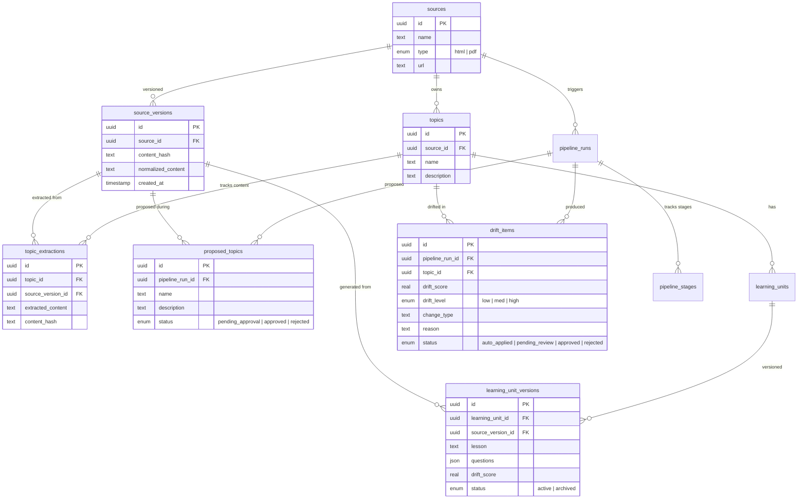
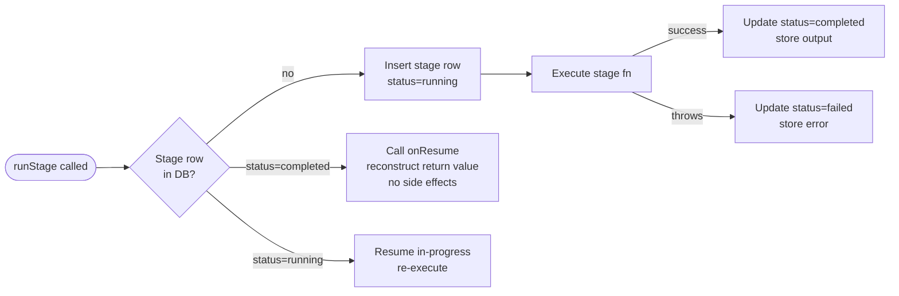
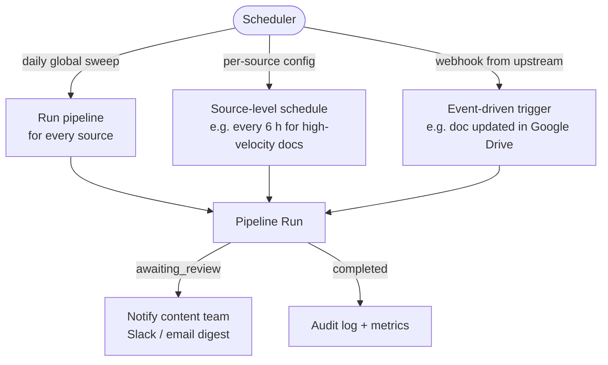

# Self-Healing Content System

An AI-powered pipeline that keeps learning content accurate as source materials evolve. When a source document changes, the system detects what shifted semantically, scores the magnitude of change per topic, and either regenerates content automatically or routes it to a human reviewer — without discarding history.

> **Scheduler note:** This implementation is manually triggered — there is no scheduler attached. This is intentional for the assignment context. In a production system, the pipeline would be driven by a scheduler: a global daily run across all sources, or granular schedules configured per source, topic, or even per-user cohort based on content freshness requirements.

---

## Goal

Learning content built on top of a source document (exam guide, technical spec, policy doc) drifts out of accuracy as the underlying source changes. The conventional response is a manual content audit — slow, expensive, and easy to miss. This system makes content maintenance continuous and automatic:

- **Track** every version of every source document
- **Detect** which topics changed and by how much
- **Decide** autonomously whether the change is safe to auto-apply or requires a human decision
- **Generate** updated lessons and MCQ questions grounded strictly in the new source
- **Preserve** the full history of every extraction, drift event, and learning unit version

---

## Setup

### Prerequisites

- Node.js 20+
- [Supabase](https://supabase.com) project (free tier works)
- LLM: local [Ollama](https://ollama.ai) **or** [OpenRouter](https://openrouter.ai) key

### 1. Clone and install

```bash
git clone <repo-url>
cd self-healing-content-system
npm install
```

### 2. Configure environment

```bash
cp .env.local.example .env.local
```

| Variable | Description |
|----------|-------------|
| `DATABASE_URL` | Supabase → Settings → Database → **Transaction pooler** URL, port **6543** |
| `SUPABASE_URL` | Supabase → Settings → API → Project URL |
| `SUPABASE_SECRET_KEY` | Supabase → Settings → API → `service_role` secret |
| `OPENAI_BASE_URL` | `http://localhost:11434/v1` (Ollama) or `https://openrouter.ai/api/v1` |
| `LLM_MODEL_NAME` | e.g. `llama3:8b` or `qwen3.5:latest` |
| `LLM_API_KEY` | `ollama` (local) or your OpenRouter key |
| `EMBEDDING_MODEL_NAME` | `nomic-embed-text:latest` (Ollama) or `text-embedding-3-small` (cloud) |
| `EMBEDDING_BASE_URL` | Only needed if embeddings use a different endpoint than LLM |
| `DEBUG_LOGS` | `true` to enable verbose pipeline logs |

#### Local (Ollama)

```bash
ollama pull llama3:8b
ollama pull nomic-embed-text
```

```env
OPENAI_BASE_URL=http://localhost:11434/v1
LLM_MODEL_NAME=llama3:8b
LLM_API_KEY=ollama
EMBEDDING_MODEL_NAME=nomic-embed-text:latest
```

#### Cloud (OpenRouter + OpenAI embeddings)

```env
OPENAI_BASE_URL=https://openrouter.ai/api/v1
LLM_MODEL_NAME=meta-llama/llama-3.1-8b-instruct:free
LLM_API_KEY=sk-or-...

EMBEDDING_BASE_URL=https://api.openai.com/v1
EMBEDDING_MODEL_NAME=text-embedding-3-small
LLM_API_KEY=sk-...   # reuse or set EMBEDDING_API_KEY separately
```

### 3. Supabase storage bucket

Supabase → Storage → **New bucket** → name: `source-files` → enable **Public**.

### 4. Push schema

```bash
npx drizzle-kit push
```

### 5. Run

```bash
npm run dev
```

Open [http://localhost:3000](http://localhost:3000).

---

## System Design

### Pipeline Overview



### Data Model



### Stage Execution Model

Each stage is wrapped by `stage-runner.ts`, which provides idempotent checkpointing:



This means a crashed or timed-out pipeline can be re-triggered and will skip already-completed stages without re-running them.

---

## Pipeline Stages

### 1 — Ingest, Normalize & Hash Check

Fetches the source document, normalizes whitespace and casing, computes an MD5 hash, and compares against the latest stored version.

**Stop conditions:**
- Hash matches latest version **and** a prior run for that version completed or is awaiting review → mark run complete, exit. No downstream processing.
- Hash matches but the prior run failed → reuse the existing source version, continue downstream (retry scenario).

**Output:** `{ stopped: boolean, sourceVersionId: string, normalized: string }`

### 2 — Extract Topics

Two responsibilities run sequentially:

**A. Re-extract existing topics**
For each approved topic, calls the extraction LLM (`buildExtractPrompt`) to pull verbatim passages from the new source version. Compares the MD5 hash against the previous extraction:
- Hash unchanged → skip (no drift possible)
- Hash changed + prior extraction exists → queue for drift analysis
- Hash changed + no prior extraction → seed baseline, defer drift to next run

**B. Propose new topics**
1. LLM scans the full source unconstrained and proposes candidate topics
2. Embedding cosine similarity filters candidates against existing topics — any candidate with similarity ≥ 0.75 to an existing topic is rejected as a sub-topic or re-branding
3. Survivors are inserted as `proposed_topics` with `pending_approval` status

**Output:** `{ new: TopicSummary[], drifted: TopicSummary[] }`

### 3 — Drift Analysis

For each drifted topic, the drift LLM compares old vs new extracted content and returns:
- `changeType`: `NO_CHANGE | MINOR_EDIT | SEMANTIC_CHANGE | MAJOR_RESTRUCTURE | CONTENT_REMOVED`
- `driftScore`: 0.0–1.0
- `reason`: one-sentence explanation

Results are stored as `drift_items` per topic.

### 4 — Repair Decision

Routes each drift item based on score threshold (`DRIFT_HIGH_THRESHOLD = 0.75`):

| Score | Level | Status | Action |
|-------|-------|--------|--------|
| 0.00–0.74 | low / med | `auto_applied` | Generate immediately |
| 0.75–1.00 | high | `pending_review` | Queue for human decision |

If any items are `pending_review` **or** any proposed topics are `pending_approval`, the run transitions to `awaiting_review` and pauses before Generate.

### 5 — Generate

Produces a lesson (2–4 sentences) and a set of MCQ questions grounded strictly in the extracted source content. Each approved topic (drift or proposed) triggers `generateForTopic`, which:

1. Archives the current active `learning_unit_version`
2. Inserts a new version with `status = active`

Run completion uses a transaction with `SELECT FOR UPDATE` on the pipeline run row to prevent race conditions when multiple reviews complete concurrently.

---

## Architectural Decisions & Tradeoffs

### Hash-based change detection at two levels

**Decision:** MD5 hash at source level (skip entire pipeline) and at extraction level (skip per-topic drift analysis).

**Tradeoff:** Hash comparison is exact — two LLM calls on identical source text can produce slightly different verbatim excerpts, causing false-positive drift detection. The mitigation is that the drift analysis LLM is the authoritative semantic judge: a `MINOR_EDIT` with score 0.2 is auto-applied even if it was a hash false positive.

The seeded extraction baseline is now generated using `buildExtractPrompt` (not the propose prompt), making baselines consistent across runs and reducing false positive rate.

### Append-only history tables

**Decision:** `source_versions`, `topic_extractions`, and `learning_unit_versions` are never deleted. Drift analysis always has access to every prior state.

**Tradeoff:** Storage grows unbounded. Acceptable for the current scope; a production system would add a retention policy.

### Two-phase topic proposal

**Decision:** LLM proposes topics unconstrained first, then a deterministic embedding cosine filter deduplicates against existing topics (threshold 0.75). Previously, passing the existing topic list to the propose prompt caused the LLM to propose sub-topics under different names.

**Tradeoff:** Adds embedding API calls per candidate. These are cheap relative to generation LLM calls, and the deduplication quality is far higher than prompt-based filtering. The threshold (0.75) is tunable — lower is stricter.

### Human-in-the-loop as a first-class concept

**Decision:** New topics always require human approval before content is generated. High-drift items (≥ 0.75) also require human approval. The pipeline has two explicit pause states (`awaiting_review`, `pending_approval`).

**Tradeoff:** Adds latency to the first run and to significant content changes. The alternative — fully autonomous generation — risks producing and serving inaccurate content without oversight. For learning/certification content, human sign-off is the right default.

### Stage checkpointing with `onResume`

**Decision:** Every stage records its status in `pipeline_stages`. On re-trigger, completed stages return their output reconstructed from DB without re-executing. Each stage's `onResume` callback reads DB state directly rather than re-running the stage function, which avoids side effects (e.g., re-running `repair_decision` would re-evaluate pending counts and overwrite run status).

**Tradeoff:** More DB reads on resume. The consistency guarantee is worth it.

### LLM abstraction via Mastra + provider-agnostic config

**Decision:** All LLM calls go through Mastra agents (`extractionAgent`, `driftAgent`, `generationAgent`). The underlying model is a single env-var swap: `OPENAI_BASE_URL` + `LLM_MODEL_NAME`. Ollama, OpenRouter, OpenAI, and any OpenAI-compatible endpoint work without code changes.

**Tradeoff:** Mastra adds a layer of indirection. If Mastra's API changes, all agents need updating. The benefit is a clean separation between agent intent and model provider.

### Separate embedding provider

**Decision:** Embeddings use their own provider config (`EMBEDDING_BASE_URL`, `EMBEDDING_MODEL_NAME`), independent of the LLM provider. This allows mixing OpenRouter for generation with OpenAI (or local Ollama `nomic-embed-text`) for embeddings.

**Tradeoff:** An additional env var. The flexibility matters in practice: most free-tier LLM providers do not expose an embeddings endpoint.

### `tryCompleteRun` with `SELECT FOR UPDATE`

**Decision:** Run completion is wrapped in a Postgres transaction that locks the pipeline run row before checking pending item counts. This eliminates the TOCTOU race where two concurrent review actions both observe "no pending items" and both attempt to close the run.

**Tradeoff:** Slightly higher DB lock contention. At review throughput (human-paced clicks), this is unnoticeable.

---

## Current Limitations

| Limitation | Impact | Production path |
|------------|--------|-----------------|
| **No scheduler** | Pipeline must be triggered manually | Attach a cron scheduler; configure interval per source, topic group, or user cohort |
| **Sequential LLM calls in Extract** | 5 topics = 5 sequential extractions; ~10 s per topic at median latency | Parallelize with `Promise.all` — straightforward refactor, held back to avoid hitting rate limits on small models |
| **No embedding cache** | Existing topic embeddings are recomputed on every run | Cache embeddings in a `topic_embeddings` table; invalidate when topic description changes |
| **LLM non-determinism in extraction** | Same source + same topic can yield slightly different verbatim passages → hash false positives | Accept: drift analysis is the semantic truth layer and handles low-drift false positives correctly |
| **No generation retry UI** | A failed LLM generation during review leaves the item approved but with no learning unit | Add a per-item "Retry generate" action on the pipeline run page |
| **Single source per pipeline run** | No batch trigger across all sources | Add a `POST /api/pipeline/run-all` that fans out one run per source |
| **No auth / multi-tenancy** | All admins share the same view; all learners see all content | Add Supabase Auth with row-level security per organization |
| **500 K character content cap** | Large documents must be split manually before ingestion | Add a chunking pre-processor that splits by section heading and indexes chunks |
| **`drizzle-kit push` in dev** | Schema push does not generate migration files; unsafe for production | Switch to `drizzle-kit generate` + `migrate` for versioned, auditable schema changes |

---

## Production Architecture (Scheduler Mode)

In production, the manual trigger is replaced by a scheduler that runs the pipeline on a configurable cadence:



**Granularity options:**
- **Global daily run** — simplest; one sweep across all sources every 24 h
- **Per-source schedule** — high-velocity sources (e.g. regulatory docs) run more frequently
- **Per-topic watch** — individual topics flagged as high-priority get their own check interval
- **Per-user cohort** — learners actively studying a topic trigger freshness checks on demand
- **Event-driven** — upstream document system (Google Drive, Notion, Confluence) sends a webhook on doc change, triggering the pipeline immediately

---

## Tech Stack

| Layer | Technology |
|-------|------------|
| Framework | Next.js 15 (App Router) + TypeScript |
| Database | Supabase Postgres via Drizzle ORM |
| File storage | Supabase Storage (PDF uploads) |
| LLM layer | Mastra AI agents (Ollama / OpenRouter / OpenAI) |
| Embeddings | `nomic-embed-text` (local) or `text-embedding-3-small` (cloud) |
| UI | shadcn/ui + Tailwind CSS 4 |
| PDF extraction | `unpdf` (Mozilla PDF.js, no native deps) |

---

## Project Structure

```
src/
├── app/
│   ├── admin/
│   │   ├── sources/          # Source list, source detail, version history
│   │   └── pipeline/         # Run list, run detail with live stage timeline
│   ├── learner/              # Topic browser, MCQ quiz
│   └── api/
│       ├── pipeline/         # Trigger run, fetch run detail
│       ├── review/
│       │   ├── drift/[id]    # Approve / reject drift items
│       │   └── topics/[id]   # Approve / reject proposed topics
│       ├── sources/          # CRUD, file upload
│       └── topics/           # Topic list
├── pipeline/
│   ├── run.ts                # 5-stage orchestration with branching logic
│   ├── stage-runner.ts       # Idempotent stage wrapper + resume
│   ├── stages/
│   │   ├── ingest.ts         # Fetch + normalize + hash check
│   │   ├── extract-topics.ts # Re-extract existing + propose new (with embedding dedup)
│   │   ├── drift-analysis.ts # Per-topic semantic diff
│   │   ├── repair-decision.ts# Threshold routing + pause logic
│   │   └── generate.ts       # Lesson + MCQ generation
│   └── prompts.ts            # All LLM prompt builders
├── db/
│   └── schema.ts             # Drizzle table definitions + enums
├── lib/
│   ├── llm.ts                # LLM + embedding model factory
│   ├── close-run.ts          # markGenerateRunning + tryCompleteRun (transactional)
│   ├── utils.ts              # normalizeText, hashContent, cn
│   └── parsers/              # HTML + PDF content extractors
└── mastra/
    └── index.ts              # extractionAgent, driftAgent, generationAgent
```

---

## Walkthrough

### Add a source

**Admin → Sources → Add Source** — choose PDF and paste a direct link (e.g. a Google Cloud exam guide PDF), or leave the URL blank and upload a file from the source detail page.

### Run the pipeline

Source detail page → **Run Pipeline**. The pipeline run page shows each stage executing live with a vertical timeline. Descriptions explain what each stage is doing.

### Review proposed topics (first run)

After Extract Topics, the run pauses. Proposed topics appear under the **Generate** section — approve to generate content, reject to discard. Approved topics immediately trigger generation.

### Simulate drift

Upload a revised version of the source document and run again:

- Low/medium drift (< 0.75) → auto-healed, new content generated immediately
- High drift (≥ 0.75) → held in review queue; approve or reject on the run page

### Learner view

**Learner → Topics** → pick a topic → read the lesson → answer MCQ questions. Each option reveals correct/incorrect feedback and the rationale sourced from the document.

---

## Useful Commands

```bash
# Reset all pipeline data (keeps schema)
npx tsx scripts/clean-db.ts

# Type check
npx tsc --noEmit
```

---

## Key Design Constraints

- **Append-only tables:** `source_versions`, `topic_extractions`, `learning_unit_versions` are never deleted. Full history is always available for drift comparison.
- **Drift threshold:** `< 0.75` → auto-apply, `≥ 0.75` → human review. Configured in `src/lib/constants.ts`.
- **Content cap:** 500,000 characters per source document. Split larger documents before ingestion.
- **Supabase pooler:** `DATABASE_URL` must point to the **Transaction pooler** (port 6543) with `ssl: 'require'`.
- **Next.js 15:** `params` in route handlers is a `Promise` — always `await params` before destructuring.
